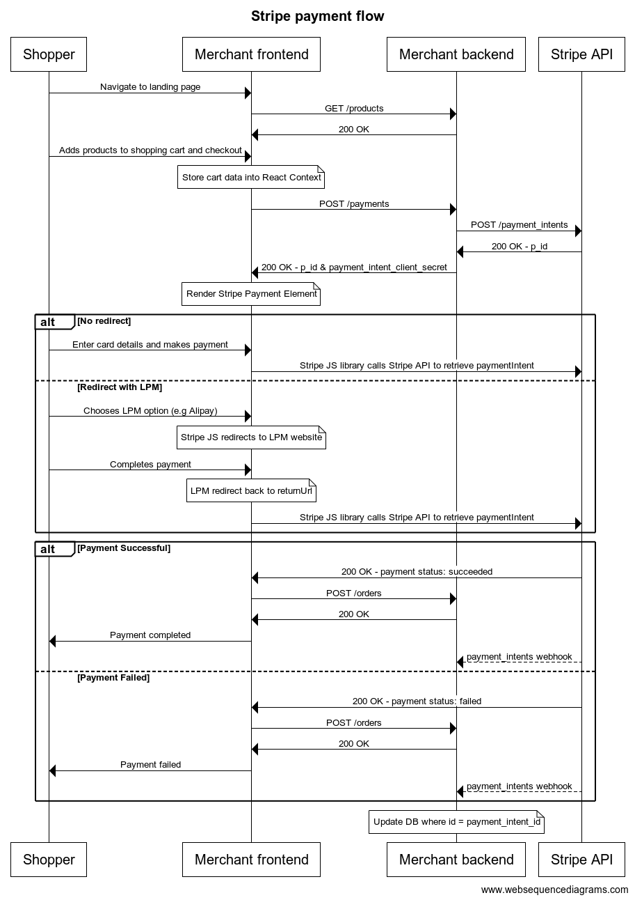

# Stripe SA take-home assignment
Assignment issued: 30 April 2025

## Key requirements

* Output a simple program that allows the user to:

	* Select a book to purchase

	* Checkout & purchase the item using Stripe Elements

	* Display a confirmation of purchase to the user with the total amount of the charge and Stripe Payment Intent ID (beginning with pi_)

* Explain how to build, configure and run your application

* How the solution works, what Stripe APIs it uses, and how it's architected

* How you approached the problem, documentation used, and challenges encountered

* How to extend this if you were to build a more robust instance of the same application

### Getting Started
#### Setting up the backend
1. Clone the repository with `git clone git@github.com:bryancresswell/stripe-demo-app.git` to your desired folder
2. Install all relevant python packages with `pip install -r requirements.txt`
3. Install postgres via `brew install postgres` , or visit this page
4. Ensure that your postgres server is running with `brew services start postgresql`
5. Verify that `psql` works by running `psql --version`
6. Run the `psql` shell and type `createuser <yourUserName> --interactive --pwprompt`
7. When prompted to be a superuser, respond with Yes
8. Create the DB with `createdb stripe-demo-app -O <yourUserName>`
9. Connect to the relevant DB you just created with `psql -d stripe-demo-app -U <yourUserName>`
10. Create the tables in the DB with `psql -d stripe-demo-app -f ./backend/utils/db/schema.sql  `
11. Populate the products in the DB with `psql -d stripedemo -f ./backend/utils/db/generate_products.sql`
12. Rename the `.env.sample` file to `.env` and fill in the variables with your respective values
14. Launch a terminal and run `python app.py` - this will launch the backend server, that is running on `http://localhost:3000`. Ensure that the port is open.
15. Your backend server is now running and listening to incoming API requests
#### Setting up the frontend
1. Navigate to `./frontend`
2. Run `npm install`
3. Launch the development server with `npm run dev`
4. Your website should now be running on `http://localhost:5713` or whichever port Vite has assigned to it

#### Checking that it all works
1. Navigate to `http://localhost:5713` or the URL that Vite automatically opens
2. You should see the products available, and the checkout page active

### Tech stack
* Backend
	* Flask
	* PostgreSQL
* Front-end
	* React
	* Typescript
	* Vite

#### Why Flask?
I used Flask for my backend mainly because my main focus here was to rapidly prototype a server that would simply just serve as the main communication channel between my front-end and Stripe's API. I generally use Flask for more rapid prototyping projects
#### Why PostgreSQL?
Before deciding on Postgres, I was deciding between two types of databases - either NoSQL or the classic RDBMS offerings. I generally turn to MongoDB these days, but after viewing the Stripe APIs - the data returned by the API are well-structured, so naturally I chose that. For a simple e-commerce application, the schemas are pretty well structured so MongoDB might have been overkill.
#### Why React + TypeScript + Vite?
I generally build my frontend apps in React & TS. Vite is just a new loader that I was curious about and decided to try using it for this project - as a way to also move away from `create-react-app`. I don't think there is a big difference after using Vite as it seems like it's more tailored for larger apps - so might have been a bit of an overkill to use Vite here.

### How it works
My solution has these key features:
* A table containing all available products on sale (`products` schema)
* A table containing all orders made (`orders` schema)
* A table containing all payments made (`payments` schema)
* A landing page which displays the available products in store
* A cart where customers are able to modify item quantity and begin the checkout flow
* A checkout page which collects shipping information, and also the Stripe Payment Element
* A payment confirmation page which parses the query string parameters in the `returnUrl` and displays the payment outcome, along with the `order_id` and the `payment_intent_id`

#### APIs used
* PaymentIntents API
	* `POST /paymentIntents` - to just create the payment intent for me to pass that value into the Stripe Payment Element
* Events API
	* I listened to webhooks here to make sure I'm parsing those incoming webhooks.
#### Architecture
The solution architecture is based off the client-server framework, where I simply provide a server that acts as the middleman between Stripe and my front-end. The customer (end-user) interacts with the merchant's (my front-end) and kickstarts the payment process, which is where my front-end then sends a `POST` request to my server, who then sends a request to Stripe's API to create the `PaymentIntent`. This is illustrated in the sequence diagram below.

 
 ### How I approached the problem
Being  generally familiar with the Stripe APIs - my main goal here was to understand the key ask. The key ask here was to simply add on payment functionality to an e-commerce book store, while ensuring that there's an easy way to add on new features in future.

Looking at the boilerplate code provided by Marko[1], I noticed that it was last maintained almost 3 years ago - a good amount of time that the project would have gone unmaintained for. The boilerplate was also a simple Jinjja2 view with a very standard backend & front-end.

I felt that wasn't enough to work off, so I decided to build my own mini e-commerce app.

As I was positioning this project more as a "customer-facing" demo, I wanted there to be a level of polish to the UI, while also having a "functioning" integration - that allows the customer to fully visualize how a potential integration with Stripe could look like for them - assuming that they have all the barebones/core functionality already built. This was why I decided to go the extra mile and create a fully functioning cart & order confirmation page along with a full DB to recreate that experience.

After that, I just broke down the problem into two areas - 1) solve the backend and have it connect to the Stripe API to create my payment intents, and 2) spend a bit more time on the front-end to make it more 'merchant friendly'.

I started with building out the schema for my DB - since that would require some planning from the beginning, and then I got to work building out the API endpoints.

The front-end took a bit more time - one issue I was trying to understand was how Stripe's Payment Element determines the country of the user - I'm assuming it's via IP address since I wasn't passing any information into `billing_details`.

I referenced a few documentation pages - and also used some code samples - which seem to address the solution:
* https://docs.stripe.com/testing?payment-method=others#non-card-payments
* https://docs.stripe.com/js/payment_intents/retrieve_payment_intent
* https://docs.stripe.com/api/payment_intents/create?lang=curl
* https://tailwindcss.com/docs/border-width - for TailwindCSS
* https://docs.stripe.com/payments/advanced - I went with creating only the Payment Element and also confirming the flow on my client
* https://docs.stripe.com/payments/quickstart - for the quickstart to working with the Stripe JS SDK
* https://docs.stripe.com/payments/payment-element/design-an-integration

#### Challenges
I don't think there were any significant blockers during implementation, since the process was quite straightforward when running through it. I did however, run into a situation where simulating PayNow wasn't really working as expected - but it seems this is a bug on the simulator side. It seems like the new tab opened for PayNow redirects to a `returnUrl` unintentionally - which is different from WeChat.

I took the opportunity to also try and identify best practices - such as the above on how Stripe's Payment Element determines country of the user without any user input - and also read up on the other APIs.

### Future improvements
If afforded the time in future, I think where this app could grow to be more useful would be:
1. Being able to show customers the different payment acceptance options (i.e single element, Checkout, Payment Element)
2. Opening up more Elements for merchants to understand the full array of choices that they have
3. Exposing an API editor for merchants to see how the APIs interact with the Stripe API in real-time so that they have a better understanding of the offering and flows
4.  Leveraging this single integration and moving to integrate with other aspects of Stripe - such as Connect/Treasury/Issuing
5. Integrate with Stripe Tax to facilitate the calculation of the tax for the items purchased here
6. Since I also process webhooks, the goal would be to also implement the best practices here, such as setting up:
	* Message queuing for webhooks via Kafka
	* Payload verification/encryption

[1] [https://github.com/marko-stripe/sa-takehome-project-python](https://github.com/marko-stripe/sa-takehome-project-python)
